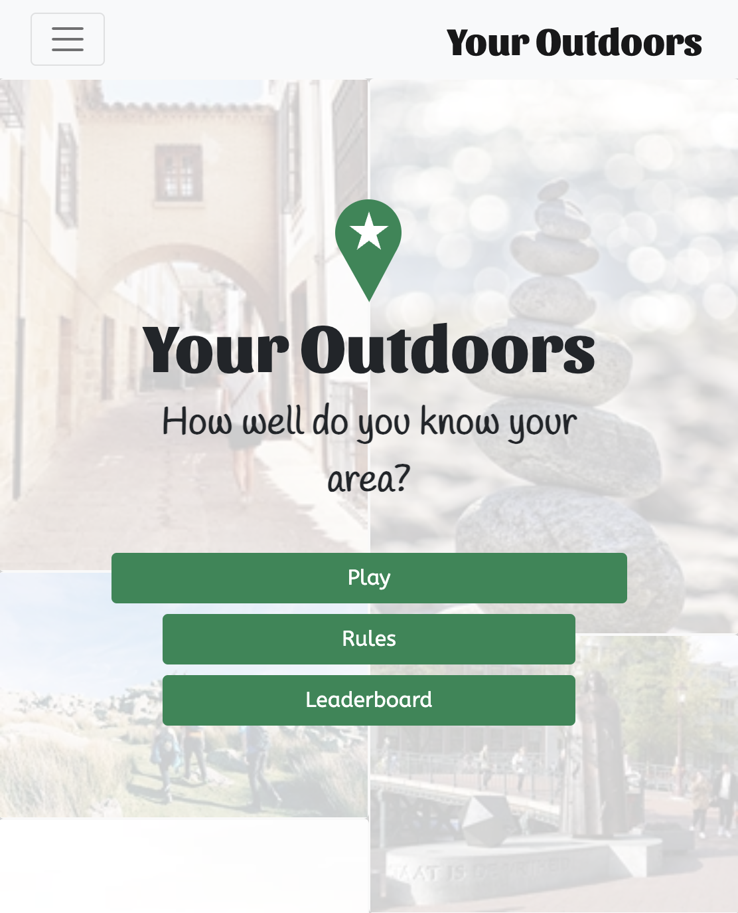
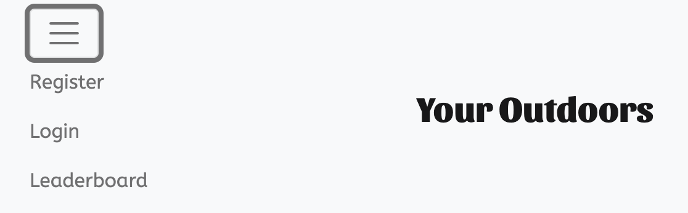
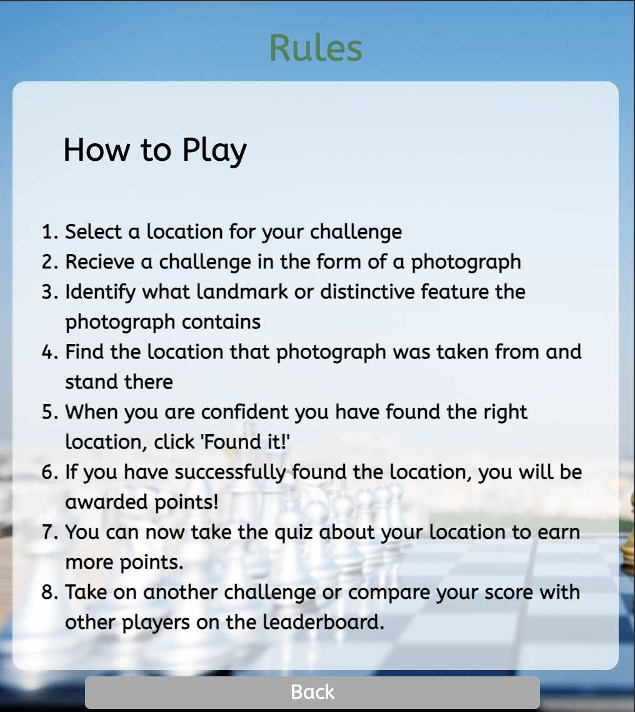
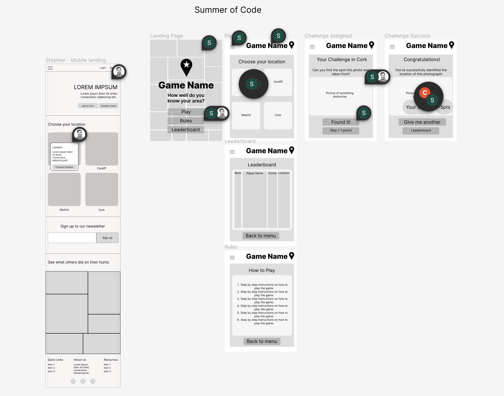

# Your Outdoors

<div align="center">
  
</div>

## Introduction

[Your Outdoors](https://suns-goods-1564630265ef.herokuapp.com/) is an interactive location based game designed to encourage people to go outdoors and explore their local area. It offers the user challenges in the form of a photograph, displaying a distinctive landmark or feature in their area. To complete the challenge they have to locate the feature and identify the spot the photograph was taken from. Users are awarded points when they complete challenges and can compare their progress with other users.

It's easy to explore the world through photographs on our phone without experiencing the places we're looking at first hand. This means we don't get the benefits provided by being in green/blue spaces, from the physical activity of walking, and vitamin D from being out on summer days. With Your Outdoors, you can find beautiful and interesting places in your neighbourhood with the added motivation of upping your position on the leaderboard, helping to motivate users to enjoy what they see in photographs in person.

## Target Audience

1. Outdoor enthusiasts: Discover and explore your local area through interactive challenges and landmark identification.
2. Active lifestyle motivators: Combine physical activity with outdoor exploration to stay fit and enjoy the benefits of green and blue spaces.
3. Competitive spirits welcome: Compete with others on the leaderboard by completing challenges and earning points.
4. Photography lovers: Capture the beauty of local landmarks while engaging in a fun and interactive experience.
5. Uncover hidden gems: Connect with your community and uncover unique locations in your neighborhood through Your Outdoors.

## Business Goals

1. Increased foot traffic: Drive more customers to nearby businesses through increased exploration and foot traffic generated by the app.
2. Heightened brand visibility: Showcase your business as a featured challenge location, boosting brand visibility and attracting potential customers.
3. Targeted marketing opportunities: Leverage the app to promote special offers or exclusive experiences to users who engage with specific challenges or reach certain milestones.

## User Stories

1. As a user, I want to explore different locations and discover landmarks and features in the images to engage in an interactive and enjoyable game experience.
2. As a user, I want to earn points and track my progress as I successfully find items and complete challenges, giving me a sense of achievement and competitiveness.
3. As a user, I want to be challenged with various tasks like taking photos or answering quiz questions related to the location, enhancing my knowledge and engagement with the surroundings.
4. As a user, I want to check in using my mobile device to validate my findings and showcase my accomplishments within the game.
5. As a user, I want to see a leaderboard that displays the top scores of other players, motivating me to improve my performance and compete with others.

## Returning Users

1. Fresh challenges: Regular updates with new and exciting tasks keep users engaged.
2. Competitive motivation: Users can compete for higher rankings on the leaderboard, driving them to return and improve their scores.
3. Uncover hidden gems: Each challenge presents an opportunity to explore new locations, providing ongoing adventure.
4. Community engagement: Connect with like-minded individuals, share experiences, and engage in conversations about outdoor adventures.
5. Personal achievement: Track progress, set goals, and experience a sense of accomplishment, motivating users to return for more

## Features

### Landing Page

<div align="center">
  
</div>

The first page seen on loading the application. The landing page introduces the game with a tag-line and gives the user options to help them navigate and understand the game.

-   Play - takes the user to the 'locations' page which allows them to select an area for their challenges to be based around.
-   Rules - takes the user to the 'rules' page and explains how to play.
-   Leaderboard - takes the user to the 'leaderboard' page and allows the user to compare their progress with other users.

### Navbar

<div align="center">
  
</div>
Appears on all pages other than landing page.

-   hamburger menu
    -   Help
    -   Register
    -   Login
    -   Leaderboard
-   Game brand
    -   Provides a link to return to the landing page.

### Play

#### Location

-   The location page allows the user to select a city in which they'd like to take on challenges.
-   Contains option to go 'back' to previous page.

#### Challenge

-   When a location is chosen the user is given a challenge in the form of a photograph.
-   They are then given options:
    -   'Take the Quiz' - Navigates user to a page which offers questions
    -   'Found it!' - allows them to use the browser location function to show they have completed the challenge.
    -   'Skip' - allows the user to skip onto a new challenge but this deducts a point from their score.
    -   'Back' - to return to previous

### Rules

-   Step-by-step details of how to play the game.
-   Contains option to go 'back' to previous page.

<div align="center">
  
</div>

### Leaderboard

-   Lists scores of other players in descending order.

#### Future Features

-   Users can upload challenges as well as complete them.
-   The challenge is timed for the opportunity to gain more points.
-   User can choose the difficulty of a challenge; points correlate.
-   A location 'search' function.
-   'All time' leader board which shows total cumulative points without the daily reset.

## Figma Prototypes

### Wireframes

Wireframes: https://www.figma.com/file/33kwyBIsqkOHgrO7CeUuoi/Summer-coding?type=design&node-id=0-1&mode=design&t=HcV9nhiV3M36kXZP-

<div align="center">
  
</div>

## Tech

In the tech section, we provide information about the technology stack, dependencies, and any technical details related to the project.

## Languages

-   HTML
-   CSS
-   JavaScript
-   Python

## Frameworks

-   Bootstrap4
-   Bootstrap5

*   Used for basic styles and outline.

## Deployment

# To run in your local machine

1. Create a virtual environment inside the folder

```bash
python3 -m venv venv
```

2. Activate the virtual environment

```bash
    source venv/bin/activate
```

3. Install requirements

```bash
    pip3 install -r requirements.txt
```

4. Create a file env.py with:

```bash
import os
os.environ['SECRET_KEY'] = "Key"
os.environ['CLOUDINARY_KEY'] = "AdH_AuJkA7GU0CfjrrilM_Q2E6c"
os.environ['DEVELOPMENT'] = "0"

```

5. Run the server

```bash
    python3 manage.py runserver

## Credits

## Image Credits
```
